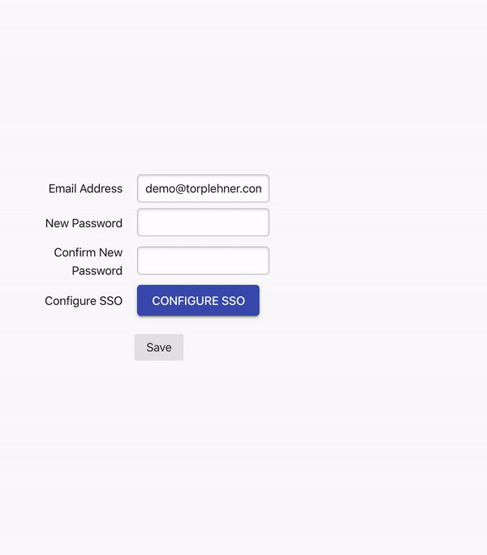

# workosjs-demo

An example Sinatra app demonstrating how onboarding an Enterprise may work utilizing the WorkOS.js embed.



For more information, check out the WorkOS.js documentation [here](http://docs.workos.com/sso/embed-workosjs)

### Installation

WorkOS.js is available as a Javascript embed via the WorkOS CDN. WorkOS is always adding new Identity Providers and keeping the embed updated, so it's important you include the script from the WorkOS CDN as opposed to copying it into your codebase. Include the following script tag on your website:

```html
<script async type="text/javascript" src="https://js.workos.com/v1"</script>

```

Then add an element to your DOM with the class `workos-container`

```html
<div
  class='workos-container'
  data-prop-publishable-key='WORKOS_PUBLISHABLE_KEY'
  data-prop-domain='CURRENT_USER_DOMAIN'
  data-prop-name='CURRENT_USER_COMPANY_NAME'
  data-prop-app-name='YOUR_COMPANY_NAME'
/>
```

When the WorkOS.js embed loads and executes, this element will be replaced by a Button that launches a modal for configuring an Identity Provider.

### Data props

Pass information into the WorkOS.js embed with _data attributes_.

| Attribute                 | Required? | Value                                                    |
|---------------------------|-----------|----------------------------------------------------------|
| data-prop-project-id      | true      | Your Project ID from the [WorkOS Dashboard](https://dashboard.workos.com/sso/configuration)                |
| data-prop-publishable-key | true      | Your Publishable Key from the [WorkOS Dashboard](https://dashboard.workos.com/api-keys)           |
| data-prop-domain          | true      | The primary domain for the current Enterprise account    |
| data-prop-name            | true      | An identifier string for the Enterprise account          |
| data-prop-app-name        | true      | The name of your application for display within the WorkOS.js embed |

### WorkOS.js Confirmations

Calls made to the WorkOS API via the WorkOS.js embed use your Publishable Key. The Publishable Key security model allows you to expose this key on the frontend of your application. But we don't want just _anyone_ to be able to configure SSO for your application should the key be leaked to a bad actor.

In order to keep your application secure, while making IdP Configuration easy for you and the Enterprise, **actions taken within the WorkOS.js embed must be confirmed with a server-side API call**.

WorkOS.js will dispatch a custom event to the parent window when an Enterprise configures an IdP. This event, `'workos:providerLinked'`, will include a `token` that you must pass to your back end. Subscribe to this event, and pass the token to your API.

```html
<script type='text/javascript'>
  document.addEventListener('workos:providerLinked', function (event){
    var xhr = new XMLHttpRequest();
    xhr.open("POST", '/confirm', true);
    xhr.setRequestHeader("Content-Type", "application/x-www-form-urlencoded");
    xhr.send("token=" + event.detail.token);
  })
</script>
```

Finally, using one of the WorkOS SDK's, confirm the pending IdP configuration with a server-side API call authenticated with your Secret Key:

```ruby
post '/confirm' do
  WorkOS::SSO.create_connection(
    source: params['token'],
  )
end
```

See the relevant documentation for our [Node](https://github.com/workos-inc/workos-node), [Go](https://github.com/workos-inc/workos-go), [Python](https://github.com/workos-inc/workos-python), [Ruby](https://github.com/workos-inc/workos-ruby) or [PHP](https://github.com/workos-inc/workos-php) SDKs.

### Try it Yourself

Ready to play with the WorkOS.js embed to see how it works? Go ahead and deploy a version of this Demo App to Heroku. You'll need your Project ID, Publishable Key and Secret Key from the WorkOS Dashboard.

[](https://heroku.com/deploy)

In order to test SSO sign-ons for Identity Providers configured through the WorkOS.js embed, you'll need an account with an IdP. Get in touch with WorkOS, we're happy to provision you an account in our `foo-corp.com` Okta instance, and can walk through a full implentation with you.

[](https://calendly.com/workos-taylor/sso-onboarding)
